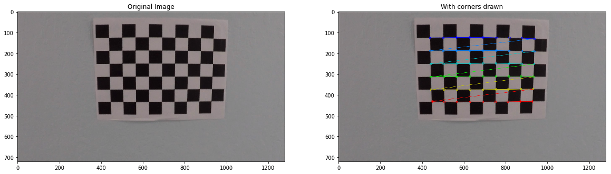
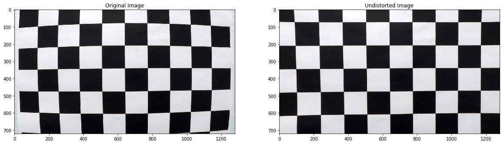
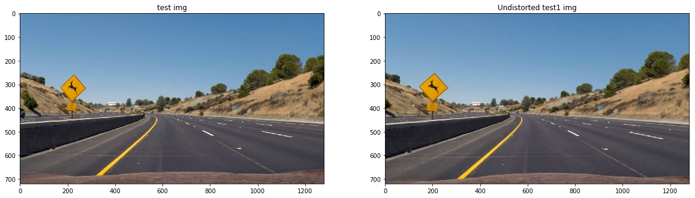
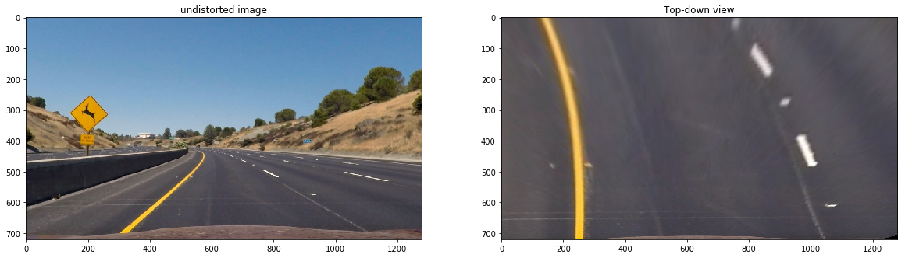
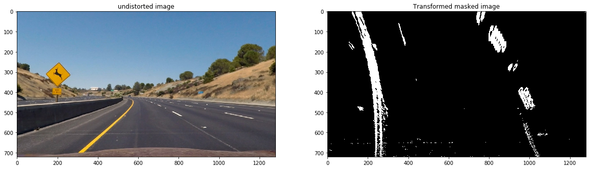
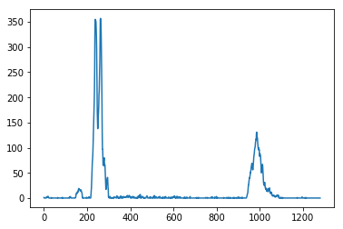
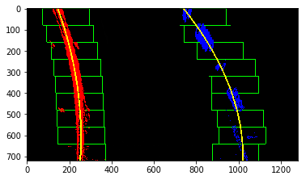

## Writeup Template

### You can use this file as a template for your writeup if you want to submit it as a markdown file, but feel free to use some other method and submit a pdf if you prefer.

---

**Advanced Lane Finding Project**

The goals / steps of this project are the following:

* Compute the camera calibration matrix and distortion coefficients given a set of chessboard images.
* Apply a distortion correction to raw images.
* Use color transforms, gradients, etc., to create a thresholded binary image.
* Apply a perspective transform to rectify binary image ("birds-eye view").
* Detect lane pixels and fit to find the lane boundary.
* Determine the curvature of the lane and vehicle position with respect to center.
* Warp the detected lane boundaries back onto the original image.
* Output visual display of the lane boundaries and numerical estimation of lane curvature and vehicle position.

[//]: # (Image References)

[image1]: ./examples/undistort_output.png "Undistorted"
[image2]: ./test_images/test1.jpg "Road Transformed"
[image3]: ./examples/binary_combo_example.jpg "Binary Example"
[image4]: ./examples/warped_straight_lines.jpg "Warp Example"
[image5]: ./examples/color_fit_lines.jpg "Fit Visual"
[image6]: ./examples/example_output.jpg "Output"
[video1]: ./project_video.mp4 "Video"

## [Rubric](https://review.udacity.com/#!/rubrics/571/view) Points

### Here I will consider the rubric points individually and describe how I addressed each point in my implementation.  

---

### Writeup / README

#### 1. Provide a Writeup / README that includes all the rubric points and how you addressed each one.  You can submit your writeup as markdown or pdf.  [Here](https://github.com/udacity/CarND-Advanced-Lane-Lines/blob/master/writeup_template.md) is a template writeup for this project you can use as a guide and a starting point.  

You're reading it!

### Camera Calibration

#### 1. Briefly state how you computed the camera matrix and distortion coefficients. Provide an example of a distortion corrected calibration image.

The code for this step is contained in the third code cell of the IPython notebook located in "Project2.ipynb".

I start by setting a grid, based on the number of chessboard corners I can count in the image.  "object points", which will contain the (x, y, z) coordinates of each chessboard corner from the provided camera images. Using these points for every provided calibration image, the image points, which are the detected point using the 'cv2.findChessboardCorners()' function, are projected onto the undistorted points.

Using both arrays, the calibration coefficients are determined and used to undistort the test image in code cell 4. 

### Pipeline (single images)

#### 1. Provide an example of a distortion-corrected image.

See the image underneath, the distorted vs the undistorted test image:

#### 2. Describe how (and identify where in your code) you used color transforms, gradients or other methods to create a thresholded binary image.  Provide an example of a binary image result.

To create the thresholded image, I end up using the sobel operator in the x-direction, as well as the separated saturation channel from HLS color space. The image underneath shows how both generate the thresholded image. On the left image, the contribution from the sobel operator is shown in green whereas the saturation channel mask is show in blue: 

#### 3. Describe how (and identify where in your code) you performed a perspective transform and provide an example of a transformed image.

Instead of seperately slicing out my region of interest, I've done this while warping the image to obtain a top-down/birdseye view of the road. In the warpimage function, I use source and destination points to determine where my outer vertex points will end up in the warped image.

The source and destination points were eyeballed from the various test images. I used these values:

| Source        | Destination   | 
|:-------------:|:-------------:| 
| 580, 455      | 180, 0        | 
| 740, 455      | 1100, 0      |
| 1100, 695     | 1100, 720      |
| 250, 695      | 180, 720        |

#### 4. Describe how (and identify where in your code) you identified lane-line pixels and fit their positions with a polynomial?

Using the lane line finding code, which is part of the course material, the same method of sliding windows and fitting polygons is applied to the masked image. First, a histogram is generated of the bottom half of the masked image to find the starting points for the lines. These values are then saved.

Next, the sliding windows are placed above the starting points. Trying to recenter on all new lane pixels. Finally, using these windows, polygons are fitted to the centers of each window.

#### 5. Describe how (and identify where in your code) you calculated the radius of curvature of the lane and the position of the vehicle with respect to center.

I did this in lines # through # in my code in `my_other_file.py`

#### 6. Provide an example image of your result plotted back down onto the road such that the lane area is identified clearly.

I implemented this step in lines # through # in my code in `yet_another_file.py` in the function `map_lane()`.  Here is an example of my result on a test image:

![alt text][image6]

---

### Pipeline (video)

#### 1. Provide a link to your final video output.  Your pipeline should perform reasonably well on the entire project video (wobbly lines are ok but no catastrophic failures that would cause the car to drive off the road!).

See the project output video:
[video_output](./video_output/project_video.mp4)

---

### Discussion

#### 1. Briefly discuss any problems / issues you faced in your implementation of this project.  Where will your pipeline likely fail?  What could you do to make it more robust?

Few issues arose during the project:
- hard to find the source points for the warping step
- very sensitive parameters for saturation and sobel steps