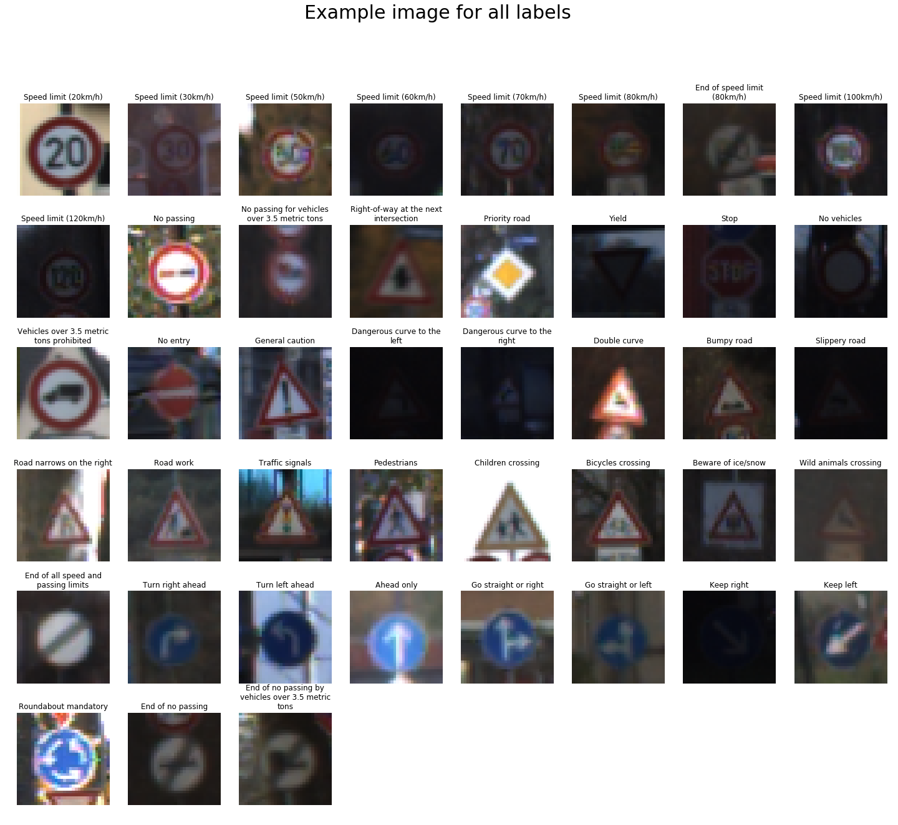
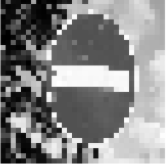
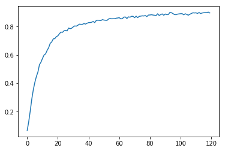
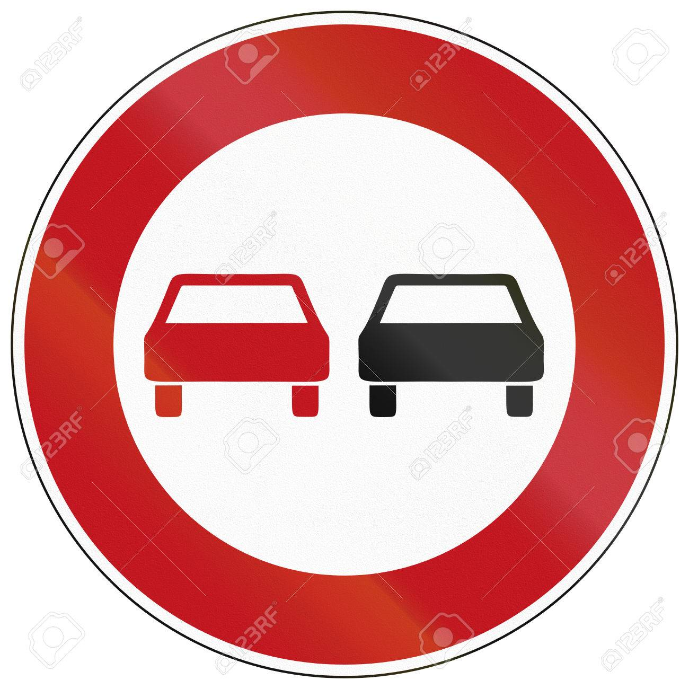
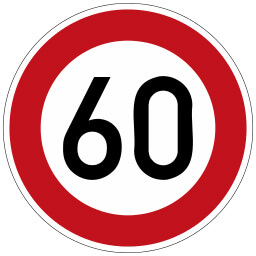
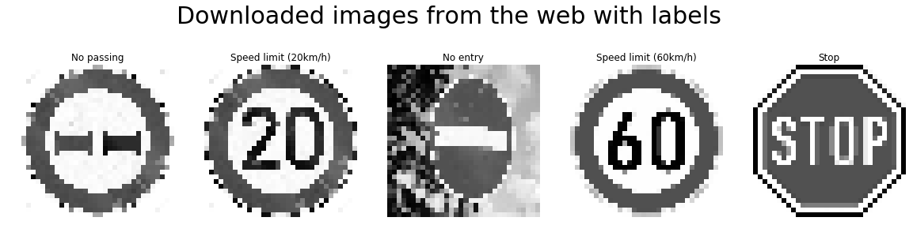

# **Traffic Sign Recognition** 

## Writeup

### You can use this file as a template for your writeup if you want to submit it as a markdown file, but feel free to use some other method and submit a pdf if you prefer.

---

**Build a Traffic Sign Recognition Project**

The goals / steps of this project are the following:
* Load the data set (see below for links to the project data set)
* Explore, summarize and visualize the data set
* Design, train and test a model architecture
* Use the model to make predictions on new images
* Analyze the softmax probabilities of the new images
* Summarize the results with a written report

[//]: # (Image References)

[image1]: ./examples/visualization.jpg "Visualization"
[image2]: ./examples/grayscale.jpg "Grayscaling"
[image3]: ./examples/random_noise.jpg "Random Noise"
[image4]: ./examples/placeholder.png "Traffic Sign 1"
[image5]: ./examples/placeholder.png "Traffic Sign 2"
[image6]: ./examples/placeholder.png "Traffic Sign 3"
[image7]: ./examples/placeholder.png "Traffic Sign 4"
[image8]: ./examples/placeholder.png "Traffic Sign 5"

## Rubric Points
### Here I will consider the [rubric points](https://review.udacity.com/#!/rubrics/481/view) individually and describe how I addressed each point in my implementation.  

---
### Writeup / README

#### 1. Provide a Writeup / README that includes all the rubric points and how you addressed each one. You can submit your writeup as markdown or pdf. You can use this template as a guide for writing the report. The submission includes the project code.

You're reading it! and here is a link to my [project code](https://github.com/IgorQuint/Udacity_Self-Driving-Car-Engineer-NanoDegree_SDCe-ND/blob/master/CarND-TrafficSignClassifier-P3/Traffic_Sign_Classifier.ipynb)

### Data Set Summary & Exploration

#### 1. Provide a basic summary of the data set. In the code, the analysis should be done using python, numpy and/or pandas methods rather than hardcoding results manually.

I used the pandas library to calculate summary statistics of the traffic
signs data set:

* The size of training set is 34,799
* The size of the validation set is 4,410
* The size of test set is 12,630
* The shape of a traffic sign image is 32x32
* The number of unique classes/labels in the data set is 43

#### 2. Include an exploratory visualization of the dataset.

Here is an exploratory visualization of the data set. It is a matplotlib imagegrid showing the first example in the training set of every individual label in the set.

### Design and Test a Model Architecture

#### 1. Describe how you preprocessed the image data. What techniques were chosen and why did you choose these techniques? Consider including images showing the output of each preprocessing technique. Pre-processing refers to techniques such as converting to grayscale, normalization, etc. (OPTIONAL: As described in the "Stand Out Suggestions" part of the rubric, if you generated additional data for training, describe why you decided to generate additional data, how you generated the data, and provide example images of the additional data. Then describe the characteristics of the augmented training set like number of images in the set, number of images for each class, etc.)

As a first step, I decided to convert the images to grayscale because ...

Here is an example of a traffic sign image before and after grayscaling.

 

#### 2. Describe what your final model architecture looks like including model type, layers, layer sizes, connectivity, etc.) Consider including a diagram and/or table describing the final model.

My final model consisted of the following layers:

| Layer         		|     Description	        					| 
|:---------------------:|:---------------------------------------------:| 
| Input         		| 32x32x3 RGB image   							| 
| Convolution 5x5     	| 1x1 stride, valid padding, outputs 28x28x6 	|
| RELU					|												|
| Max pooling	      	| 2x2 stride,  outputs 14x14x6 				|
| Convolution 5x5	    | 1x1 stride, valid padding, outputs 10x10x16 	|
| RELU					|												|
| Max pooling	      	| 2x2 stride,  outputs 5x5x16 				|
| Fully connected		| input 400, output 120, flat				|
| RELU					|												|
| Dropout					| Keep 60%												|
| Fully connected		| input 120, output 84, flat				|
| RELU					|												|
| Dropout					| Keep 60%												|
| Fully connected		| input 84, output 43, flat				|
| Softmax				| on logits        									|
 

#### 3. Describe how you trained your model. The discussion can include the type of optimizer, the batch size, number of epochs and any hyperparameters such as learning rate.

To train the model, I used an Adam optimizer on the cross entropy loss of the softmax probabilities. The following hyperparameters were set:

| HyperParameter         		|     Value	        					| 
|:---------------------:|:---------------------------------------------:| 
| Epocs         		| 120   							| 
| Batchsize     	| 128 	|
| Dropout					| 0.6 												|
| Learning rate	      	| 0.0001 				|
| Mu	      	| 0 				|
| Sigma	      	| 0.1 				|

#### 4. Describe the approach taken for finding a solution and getting the validation set accuracy to be at least 0.93. Include in the discussion the results on the training, validation and test sets and where in the code these were calculated. Your approach may have been an iterative process, in which case, outline the steps you took to get to the final solution and why you chose those steps. Perhaps your solution involved an already well known implementation or architecture. In this case, discuss why you think the architecture is suitable for the current problem.

My final model results were:
* training set accuracy of .956
* validation set accuracy of .883
* test set accuracy of .872

See the accuracy improve after every epoch:

An well known network architecture was chosen:
* What architecture was chosen?
I used the LeNet architecture based on the paper by Yann leCunn

* Why did you believe it would be relevant to the traffic sign application?
Works very well for image classification.

* How does the final model's accuracy on the training, validation and test set provide evidence that the model is working well?
The accuracy on the training, validation and test set are all relatively high (>.850), implying steady model performance out of sample. Therefore overfitting is unlikely.

### Test a Model on New Images

#### 1. Choose five German traffic signs found on the web and provide them in the report. For each image, discuss what quality or qualities might be difficult to classify.

Here are five German traffic signs that I found on the web:

  
 .png)

The first image might be difficult to classify because ...

After preprocessing these images are used for classification. Below a visualization with labels:
 

#### 2. Discuss the model's predictions on these new traffic signs and compare the results to predicting on the test set. At a minimum, discuss what the predictions were, the accuracy on these new predictions, and compare the accuracy to the accuracy on the test set (OPTIONAL: Discuss the results in more detail as described in the "Stand Out Suggestions" part of the rubric).

Here are the results of the prediction:

| Image			        |     Prediction	        					| 
|:---------------------:|:---------------------------------------------:| 
| No passing      		| No passing   									| 
| Speed limit (20km/h)     			| Speed limit (30km/h) 										|
| No entry					| No entry											|
| Speed limit (60km/h)	      		| Speed limit (60km/h)					 				|
| Stop			| Go straight or right      							|

The model was able to correctly guess 3 of the 5 traffic signs, which gives an accuracy of 60%. This compares somewhat negatively to the accuracy on the test set of 0.872. However, we are just using 5 samples here, so every wrong prediction will impact the accuracy score negatively with 20%. When providing more images, I expect the accuracy to increase drastically, as the impact of misclassifications diminishes.

#### 3. Describe how certain the model is when predicting on each of the five new images by looking at the softmax probabilities for each prediction. Provide the top 5 softmax probabilities for each image along with the sign type of each probability. (OPTIONAL: as described in the "Stand Out Suggestions" part of the rubric, visualizations can also be provided such as bar charts)

The code for making predictions on my final model is located in the 11th cell of the Ipython notebook.

For the first image, the model is very sure that this is a no-passing sign (probability of 0.99), and the image does indeed contain a no passing sign. The top five soft max probabilities were:

| SoftMax Probability         	|     Prediction	        					| 
|:---------------------:|:---------------------------------------------:| 
| .99         			| No passing   									| 
| .99     				| Speed limit (30km/h) 										|
| .89					| No entry											|
| .98	      			| Speed limit (60km/h)					 				|
| .82				    | Go straight or right      							|

